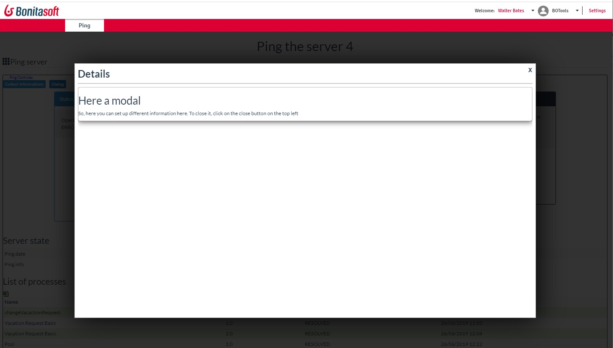

# page_ping
Demonstrate a Custom page with Html, AngularJS, customRESTAPI embeded
 

 

Demonstrate the BonitaEvent librairy, and the result
 

Demonstrate the BonitaProperties librairy, and how to save a value in the Bonita Database
 

And a example of Modal in the custom page
 
